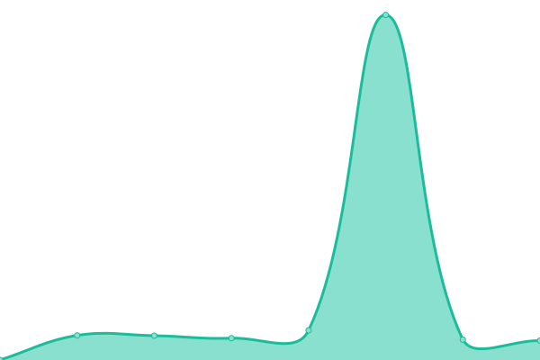
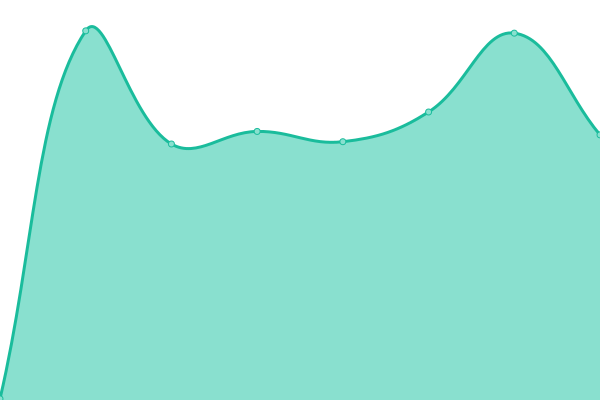

# [📈 Live Status](https://awaisattiq.github.io/upptime): <!--live status--> **🟩 All systems operational**

This repository contains the open-source uptime monitor and status page for [awaisattiq](https://awaisattiq.github.io/upptime), powered by [Upptime](https://github.com/upptime/upptime).

With [Upptime](https://upptime.js.org), you can get your own unlimited and free uptime monitor and status page, powered entirely by a GitHub repository. We use [Issues](https://github.com/awaisattiq/upptime/issues) as incident reports, [Actions](https://github.com/awaisattiq/upptime/actions) as uptime monitors, and [Pages](https://awaisattiq.github.io/upptime) for the status page.

<!--start: status pages-->
<!-- This summary is generated by Upptime (https://github.com/upptime/upptime) -->
<!-- Do not edit this manually, your changes will be overwritten -->
<!-- prettier-ignore -->
| URL | Status | History | Response Time | Uptime |
| --- | ------ | ------- | ------------- | ------ |
|  [EBX API](https://api.etihadtown.com.pk/) | 🟩 Up | [ebx-api.yml](https://github.com/awaisattiq/upptime/commits/HEAD/history/ebx-api.yml) | 

 632ms
     
 | 

<a href="https://awaisattiq.github.io/upptime/history/ebx-api">100.00%</a>
    

|  [Strapi Server](http://49.12.146.184:1337/) | 🟩 Up | [strapi-server.yml](https://github.com/awaisattiq/upptime/commits/HEAD/history/strapi-server.yml) | 

 270ms
     
 | 

<a href="https://awaisattiq.github.io/upptime/history/strapi-server">100.00%</a>
    

<!--end: status pages-->

[**Visit our status website →**](https://awaisattiq.github.io/upptime)
